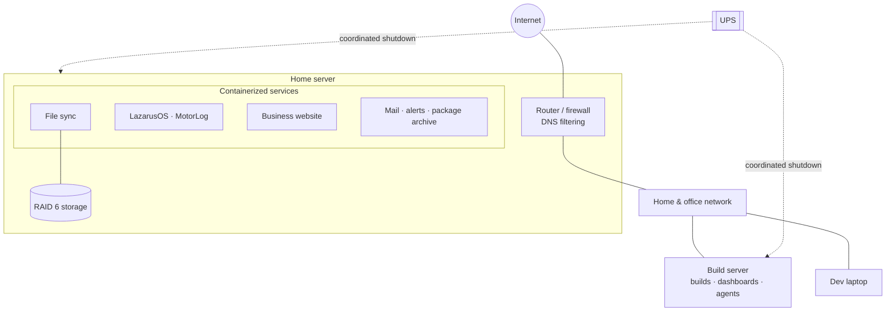
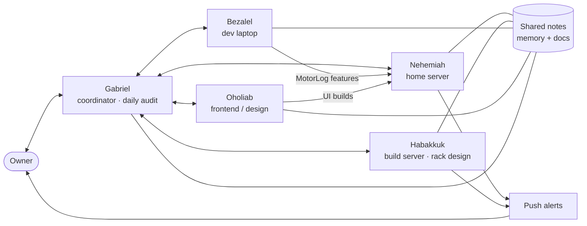
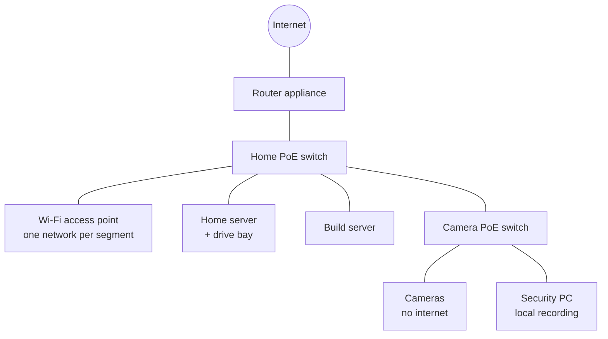

# Architecture diagrams

These show roles only: no addresses, hostnames or access paths.

## Today

```mermaid
flowchart TB
  NET((Internet)) --- R[Router / firewall<br/>DNS filtering]
  subgraph HS[Home server]
    R
    subgraph APPS[Containerized services]
      NC[File sync]
      BIZ[LazarusOS · MotorLog]
      WEB[Business website]
      OTHER[Mail · alerts · package archive]
    end
    RAID[(RAID 6 storage)]
    NC --- RAID
  end
  R --- LAN[Home & office network]
  LAN --- BS[Build server<br/>builds · dashboards · agents]
  LAN --- LAP[Dev laptop]
  UPS[[UPS]] -. coordinated shutdown .-> HS & BS
```

## Agent fleet

```mermaid
flowchart LR
  OWNER([Owner]) <--> GAB[Gabriel<br/>coordinator · daily audit]
  GAB <--> NEH[Nehemiah<br/>home server]
  GAB <--> HAB[Habakkuk<br/>build server · rack design]
  GAB <--> BEZ[Bezalel<br/>dev laptop]
  GAB <--> OHO[Oholiab<br/>frontend / design]
  BEZ -- MotorLog features --> NEH
  OHO -- UI builds --> NEH
  NEH & HAB & BEZ & OHO & GAB --- VAULT[(Shared notes<br/>memory + docs)]
  NEH & HAB --> ALERT[Push alerts] --> OWNER
```

## Target (mini rack)

```mermaid
flowchart TB
  NET((Internet)) --- OPN[Router appliance]
  OPN --- HSW[Home PoE switch]
  HSW --- AP[Wi-Fi access point<br/>one network per segment]
  HSW --- NHS[Home server<br/>+ drive bay]
  HSW --- BS[Build server]
  HSW --- SSW[Camera PoE switch]
  SSW --- CAM[Cameras<br/>no internet]
  SSW --- NVR[Security PC<br/>local recording]
```
